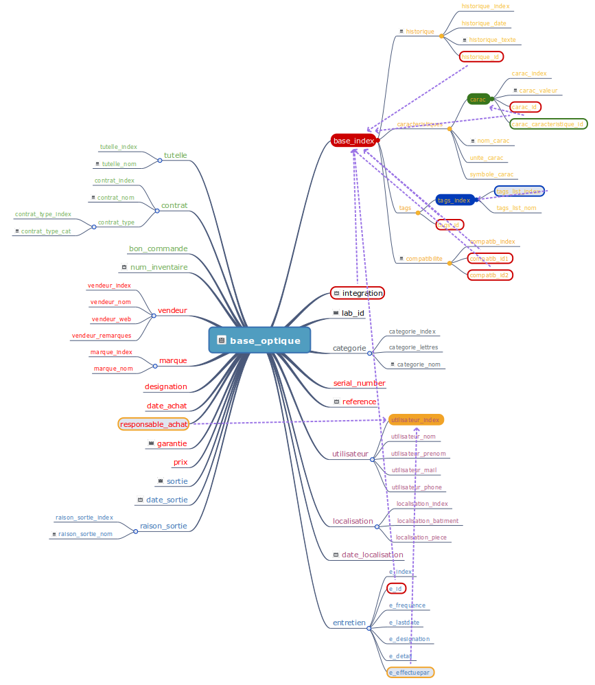

# Inventaire

* Créer la base de données sur le modèle de la commande sql fournie
* Créer un dossier files à la racine de l’hébergement avec droit 775 appartenant à www-data:www-data

# Taille de fichiers
Par défaut, la taille maximale des fichiers envoyés en POST est de 2 Mo. Pour modifier cette valeur :

/etc/php/7.1/apache2/conf.d/00-user.ini :
```
upload_max_filesize = 10M
post_max_size = 10M
```

## Pour information

La structure de la base est la suivante :



Document réalisé sur framamind :
* [lien pour  lecture](https://framindmap.org/c/maps/197903/public)
* [lien pour modification](https://framindmap.org/c/maps/197903/edit)


