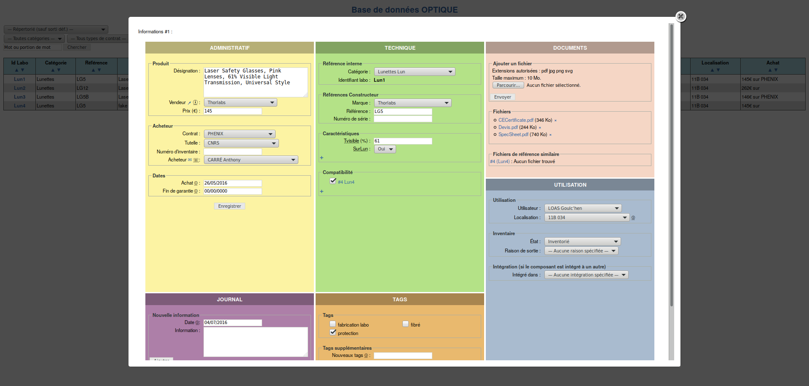

# Inventaire

## Description

Outil en ligne permettant de gérer à plusieurs une base de données du matériel d’une unité en le liant à différents documents (data-sheet, caractérisation,…).

L’outil tente d’être le plus universel possible :
* pas de catégorie ou tags prédéfini

Les parties administrative et technique sont clairement différenciées pour permettre de remplir uniquement une partie si on le souhaite

## Aperçu

