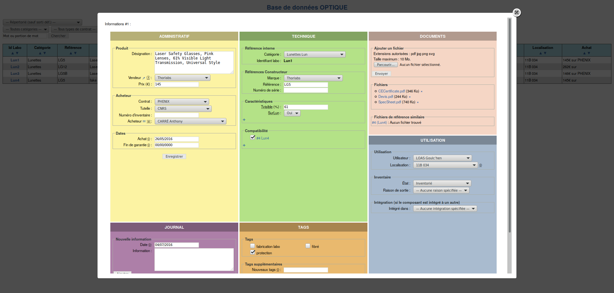

# Inventaire

## Description

Outil en ligne permettant de gérer à plusieurs une base de données du matériel d’une unité en le liant à différents documents (data-sheet, caractérisation,…).

L’outil tente d’être le plus universel possible :
* pas de catégorie ou tags prédéfini

Les parties administrative et technique sont clairement différenciées pour permettre de remplir uniquement une partie si on le souhaite

## Aperçu

## TODO

* **Ajout** : La page d’ajout d’un nouvel élément n’est pas en place…
* **Identifiant labo** : Possibilité de choisir l’identifiant manuellement.
* **Catégories de caractéristiques** : Les caractéristiques vont vite devenir très nombreuses et difficiles à trouver dans le sélecteur, penser à créer des catégories de caracs (dimensions, optique, électronique,…)
* **Entretien** : Un bloc permettant de définir des entretiens à faire et des fréquence, des alertes pourraient alors s’afficher dans la liste.
* **Documents** : Possibilité d’associer des documents soit à l’objet soit à la référence (data-sheet commune…).
* **Select** : Améliorer les selecteurs, en particulier le gestionnaire des tags, avec [Choosen](https://harvesthq.github.io/chosen/#selected-and-disabled-support) par exemple.
* **Droits** : Ajouter un gestionnaire des droits, qu’un stagiaire ne puisse pas éditer les informations par exemple. Pour plus de simplicité, peut-être juste cacher les boutons de validation…
* **Statistiques** : Ajouter des statistiques sur les éléments affichés (nombre d’entrées, prix, camemberts des responsables d’achat, des contrats,…
* **Page d’administration** : Vider le dossier trash, gestion de backup, édition de tags ou d’utilisateurs…
* **Division cellulaire** : Que faire si l’on casse un élément et qu’il devient 2 ou 3 (cas déjà arrivé pour un milieu actif…).
* **Suppression sécurisée** : Un historique des modifications ? Avec nom et date ?
* **Traduction** : Supporter plusieurs langues ?
* **Intégration** : cacher ce fieldset si l’élément n’est pas intégré.

