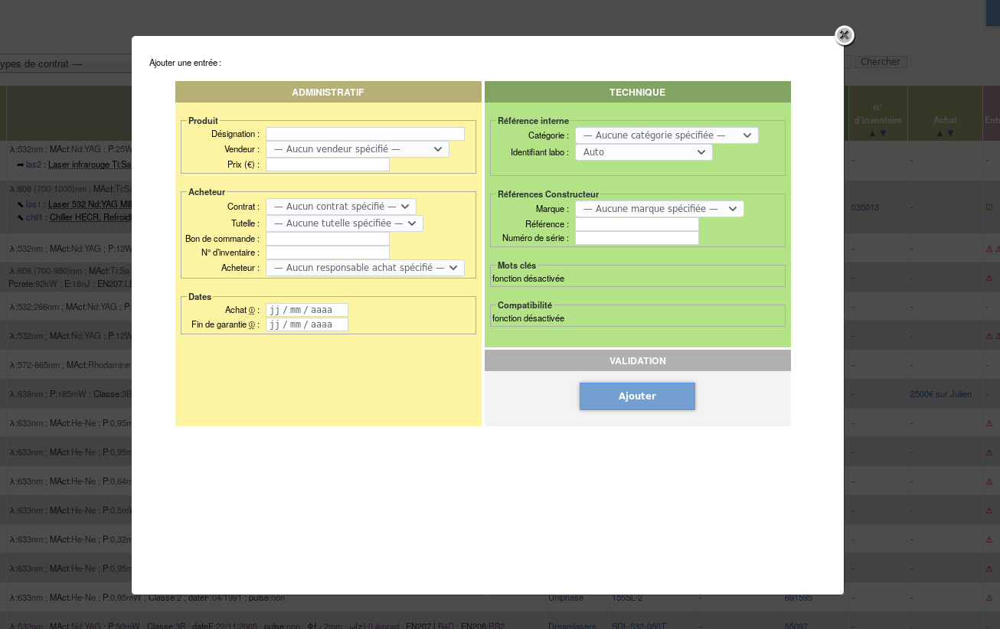
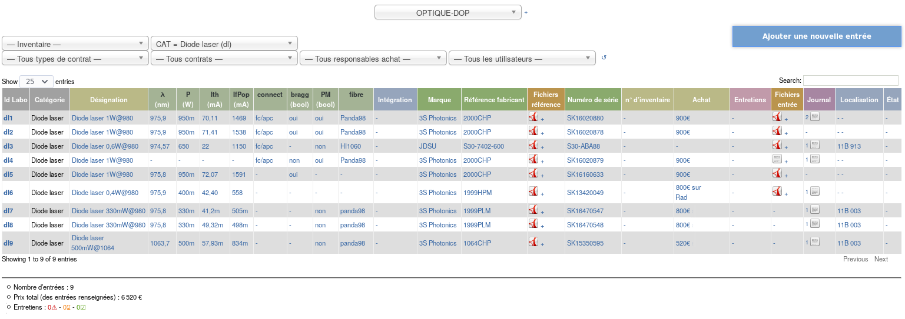

# Inventaire

## Description

Outil en ligne permettant :
* de gérer à plusieurs un inventaire du matériel d’un laboratoire
* d’associer directement différents documents (data-sheet, caractérisation,…)
* de gérer les différents entretiens (nettoyage, calibration,…)
* un journal est disponible pour chaque composant listé
* plusieurs inventaires peuvent être créés (plusieurs équipes ou domaines par exemple…)

Les sections « administratif » et « technique » sont clairement différenciées pour permettre de remplir uniquement une partie si on le souhaite.

## Aperçu







## Installation

### Pré-requis
* PHP (testé avec php 7.1)
* MySQL (testé avec mysql 15.1)

### Installation
* Remplir 0_config.php selon vos paramètres
* Un message indiquant qu’aucune base n’est détecté s’affiche, cliquer sur +
* Choisir le nom de la base et valider
* Créer un dossier files à la racine de l’hébergement avec droit 775 appartenant à www-data:www-data

### Taille de fichiers
Par défaut, la taille maximale des fichiers envoyés en POST est de 2 Mo. Pour modifier cette valeur :

/etc/php/7.1/apache2/conf.d/00-user.ini :
```
upload_max_filesize = 10M
post_max_size = 10M
```


## TODO

- [x] **Identifiant labo** : Possibilité de choisir l’identifiant manuellement.
- [x] **Plusieurs inventaires**
- [ ] **Datatables** : En français
- [ ] **Caractéristiques** : Si affichage d’une catégorie unique, les caractéristiques sont affichées séparément sous forme de colonne triables par datatables
- [ ] **Simplification de saisie** : duplication de fiches, ajouter une commande
- [ ] **Intégration** : Si intégré, afficher un lien dans listing vers le conteneur. Mais également gérer les lots. Il peut arriver qu’un lot de filtre soit acheté et que l’un d’eux soit intégré dans un montage…
- [ ] **Rangement** : Ajouter une case pour indiquer où ranger le matériel quand non utilisé.
- [ ] **Documents** : Supporter le glisser/déposer, supporter l’envoi de fichier depuis une adresse
- [ ] **Type de contrat** : Afficher le type de contrat dans l’intitulé des contrats pour un meilleur affichage = « sur Chaire Julien » plutôt que « sur Julien »
- [ ] **Droits** : Ajouter un gestionnaire des droits, qu’un stagiaire ne puisse pas éditer les informations par exemple. Pour plus de simplicité, peut-être juste cacher les boutons de validation…
- [ ] **Vous avez un message** : Toutes les modifications de la base doivent être suivies d’un message temporaire.
- [x] **Statistiques** : Ajouter des statistiques sur les éléments affichés (nombre d’entrées, prix, camemberts des responsables d’achat, des contrats,…
- [ ] **Page d’administration** : Vider le dossier trash, gestion de backup, édition de tags ou d’utilisateurs, suppression de catégorie vide…
- [ ] **Division cellulaire** : Que faire si l’on casse un élément et qu’il devient 2 ou 3 (cas déjà arrivé pour un milieu actif…).
- [ ] **Suppression sécurisée** : Un historique des modifications ? Avec nom et date ?
- [ ] **Traduction** : Supporter plusieurs langues ?
- [ ] **Réforme** : Gérer les "à réformer" et les "réformé" ?
- [ ] **Tri** : Le tri par catégorie dans index.php ne doit pas être fait sur le numéro correspondant à la catégorie mais au nom de la catégorie
- [ ] **Aide plan** : Ajouter un bouton pour gérer l’aide plan

## Pour information

La structure de la base est la suivante :


Document réalisé sur framamind :
* [lien pour  lecture](https://framindmap.org/c/maps/197903/public)
* [lien pour modification](https://framindmap.org/c/maps/197903/edit)
